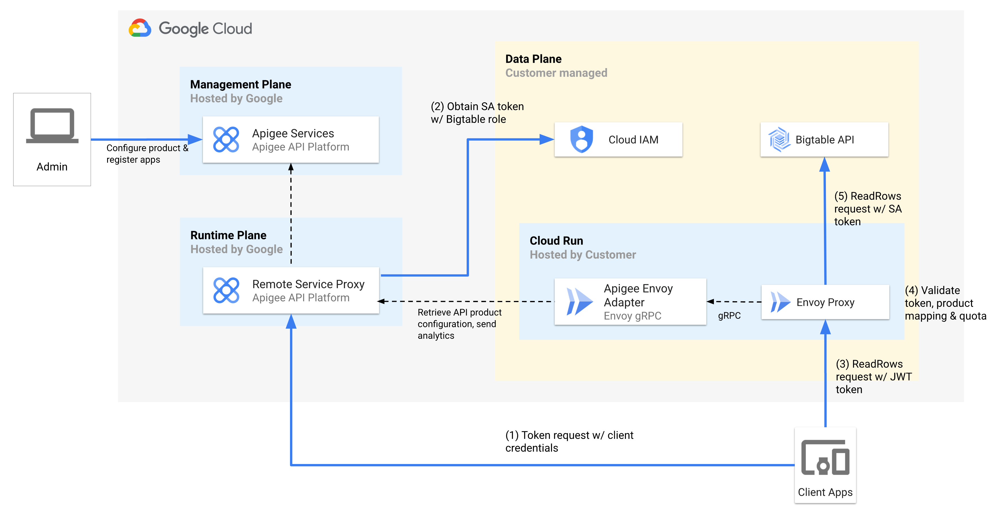

# Leveraging Apigee and Cloud Run to provide API management for Bigtable gRPC APIs

This repo demonstrates how to use the [multi-container feature](https://cloud.google.com/run/docs/deploying#sidecars) of Cloud Run to host an [Envoy](https://www.envoyproxy.io/) proxy, with API management capabilities via the [Apigee Adapter for Envoy](https://cloud.google.com/apigee/docs/api-platform/envoy-adapter/latest/concepts), in front of the [Bigtable gRPC API](https://cloud.google.com/bigtable/docs/reference/data/rpc). This sample shows how Apigee can apply authentication and API usage quotas in front of streaming [gRPC](https://grpc.io/) APIs.

## A note on gRPC support in Apigee

At the time of writing, Apigee offers the ability to [create gRPC API proxies](https://cloud.google.com/apigee/docs/api-platform/fundamentals/build-simple-api-proxy#creating-grpc-api-proxies) using the native Apigee runtime gateway. However, currently this mechanism only supports [unary RPCs](https://grpc.io/docs/what-is-grpc/core-concepts/#unary-rpc). For use cases that require [streaming RPC](https://grpc.io/docs/what-is-grpc/core-concepts/#server-streaming-rpc) support, customers can leverage the pattern shown in this sample.

## Architecture

The sample architecture is shown below.

<p align="center">

</p>

## Prerequisities

1. Ensure the following tools are available in your terminal ([Cloud Shell](https://cloud.google.com/shell) already has these available):
    * [gcloud SDK](https://cloud.google.com/sdk/docs/install)
    * [jq](https://jqlang.github.io/jq/)

2. This sample requires the following GCP services to be enabled:
    * [Cloud Build](https://cloud.google.com/build)
    * [Artifact Registry](https://cloud.google.com/artifact-registry)
    * [Cloud Run](https://cloud.google.com/run)
    * [Apigee](https://cloud.google.com/apigee)
    * [Bigtable](https://cloud.google.com/bigtable)

3. You'll need a Bigtable instance provisioned with data available to query. If you don't have one you can follow this [quickstart](https://cloud.google.com/bigtable/docs/create-instance-write-data-cbt-cli) guide.

4. You must also have an Apigee organization provisioned.  If you don't have one you can create one following the instructions [here](https://cloud.google.com/apigee/docs/api-platform/get-started/provisioning-intro). Your Apigee instance should be configured with [external access](https://cloud.google.com/apigee/docs/api-platform/get-started/configure-routing#external-access) for API traffic.

5. To deploy this sample, your GCP user account must have permission to [create service accounts and keys](https://cloud.google.com/iam/docs/understanding-roles#service-accounts-roles), [create builds](https://cloud.google.com/iam/docs/understanding-roles#cloudbuild.builds.editor), [upload build artifacts](https://cloud.google.com/iam/docs/understanding-roles#artifact-registry-roles) and [deploy Cloud Run services](https://cloud.google.com/iam/docs/understanding-roles#run.developer). 

6. You must also have permission to create and deploy Apigee API Proxies, Shared Flows, KVMs, API Products, Developers and Apps. For the sake of simplicity, it's easiest to assign the necessary Apigee permissions by granting the [Org Admin](https://cloud.google.com/apigee/docs/api-platform/system-administration/apigee-roles#apigee-specific-roles) role to your user.

## Setup

1. Follow these [instructions](https://cloud.google.com/apigee/docs/api-platform/envoy-adapter/v2.0.x/example-apigee#provision-apigee) to provision the remote service for
the Apigee Envoy Adapter. Once this is done, copy the resulting `config.yaml` file into the `/envoy-adapter`
directory.

2. Edit `env.sh` and replace with your GCP project ID, region, Apigee [environment](https://cloud.google.com/apigee/docs/api-platform/fundamentals/environments-working-with), and the [environment group](https://cloud.google.com/apigee/docs/api-platform/fundamentals/environmentgroups-working-with) hostname. Then from a terminal, source the `env.sh` file:
```bash
source ./env.sh
```

3. Next, run the following command to create a Docker repository in Artifact Registry:
```bash
gcloud artifacts repositories create apigee-cloudrun-mcs-bigtable \
    --repository-format=docker \
    --location=us \
    --description="Docker images for Apigee Envoy sample" \
    --immutable-tags
```

4. Execute the following commands to build the Envoy Adapter image:
```bash
cd envoy-adapter
./build.sh
```

5. Next, build the Envoy image:
```bash
cd ../envoy-sidecar
./build.sh
```

6. Finally, deploy the Cloud Run service and Apigee configuration:
```bash
cd ..
./deploy.sh
```

## Test it
If the deploy script completes successfully it will print out a set of app credentials, plus instructions to obtain an access token from Apigee.  Follow the instructions to obtain a token, and then pass it to a Bigtable gRPC request via the `Authorization` header.

Here is an  example using [gRPCurl](https://github.com/fullstorydev/grpcurl):

```bash
$ grpcurl -import-path /path/to/protos/googleapis -proto google/bigtable/v2/bigtable.proto -d '{"table_name": "projects/someproject/instances/someinstance/tables/sometable"}' -H "Authorization: Bearer $TOKEN" $RUN_DOMAIN:443 google.bigtable.v2.Bigtable/ReadRows
```

If you have correctly formatted your request and provided a valid token, you should receive a successful response from the API.  This sample configures Apigee with a [quota](https://cloud.google.com/apigee/docs/api-platform/publish/what-api-product#quotas) of 10 request per minute for the API product. Repeat the test request ten more times to observe an error, as the quota limit is enforced by Apigee. You can [edit the API product](https://cloud.google.com/apigee/docs/api-platform/publish/create-api-products#edit) to change the quota setting and experiment with different values.

## Clean up

Run the following to clean up the deployed artifacts:
```bash
./cleanup.sh
```

## Disclaimer

This is not an officially supported Google product.